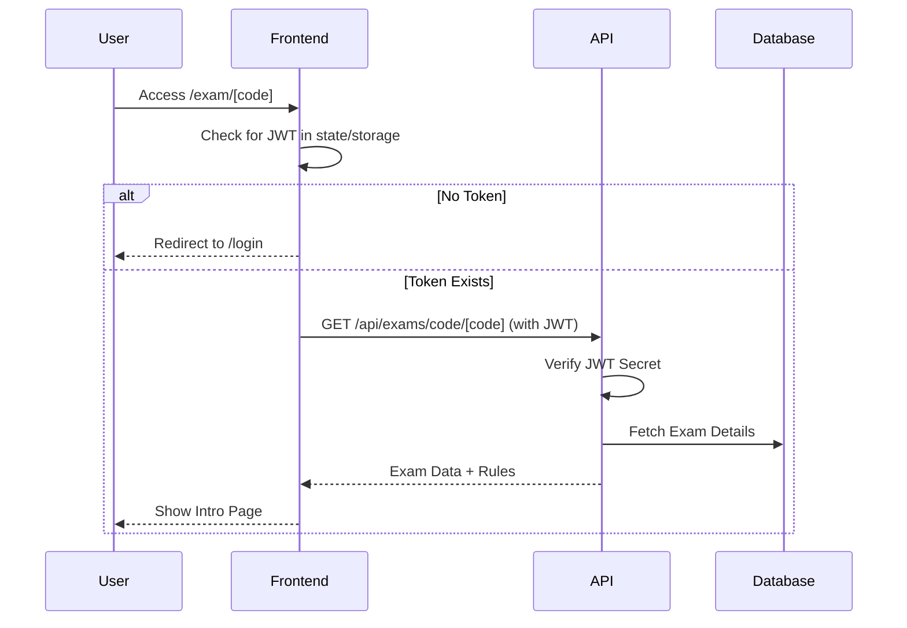

# 🔐 Exam Authentication & Security Flow

This document describes how the system secures exam access using JWT-based authentication.

---

## 📋 Overview

Every request to an exam or restricted API requires a valid JSON Web Token (JWT). The system ensures that:
1. Users are logged in before starting an exam.
2. Users can only access exams they are authorized for.
3. Exam sessions are tied to a unique user ID.

---

## 🔄 Authentication Flow

---

## 🛠️ Implementation Details

### 1. **JWT Verification**
The system uses the `jose` library for JWT verification on both the frontend and backend.
- **Secret**: Stored in `JWT_SECRET` environment variable.
- **Payload**: Contains `sub` (User ID), `email`, and `role`.

### 2. **Session Persistence**
- Tokens are stored in a standard way (e.g., Secure Cookies or LocalStorage via `lib/db/client.ts`).
- The `getAuthToken()` utility in `frontend/lib/db/client.ts` retrieves the token for API calls.

### 3. **Middleware Protection**
- API routes in `app/api/` verify the token at the start of every request.
- If the token is missing or invalid, a `401 Unauthorized` response is returned.

---

## 📝 User Experience Scenarios

### **Scenario 1: New Student**
1. Student enters the exam URL.
2. System detects no active session → Redirects to Login.
3. Student logs in → Token is generated and stored.
4. System redirects back to the original Exam URL.
5. Exam Intro page loads successfully.

### **Scenario 2: Active Session**
1. Student enters the exam URL.
2. System detects valid token → Loads Exam Intro immediately.
3. Student completes the system check and starts the exam.

---

## 🛡️ Security Features

- **RBAC (Role Based Access Control)**: Admins and Teachers can view all results; Students can only view their own.
- **Session Locking**: Once a session is started, the `exam_id` and `user_id` are locked in the `exam_sessions` table.
- **Expiration**: Tokens have a limited validity period (configured during generation).
